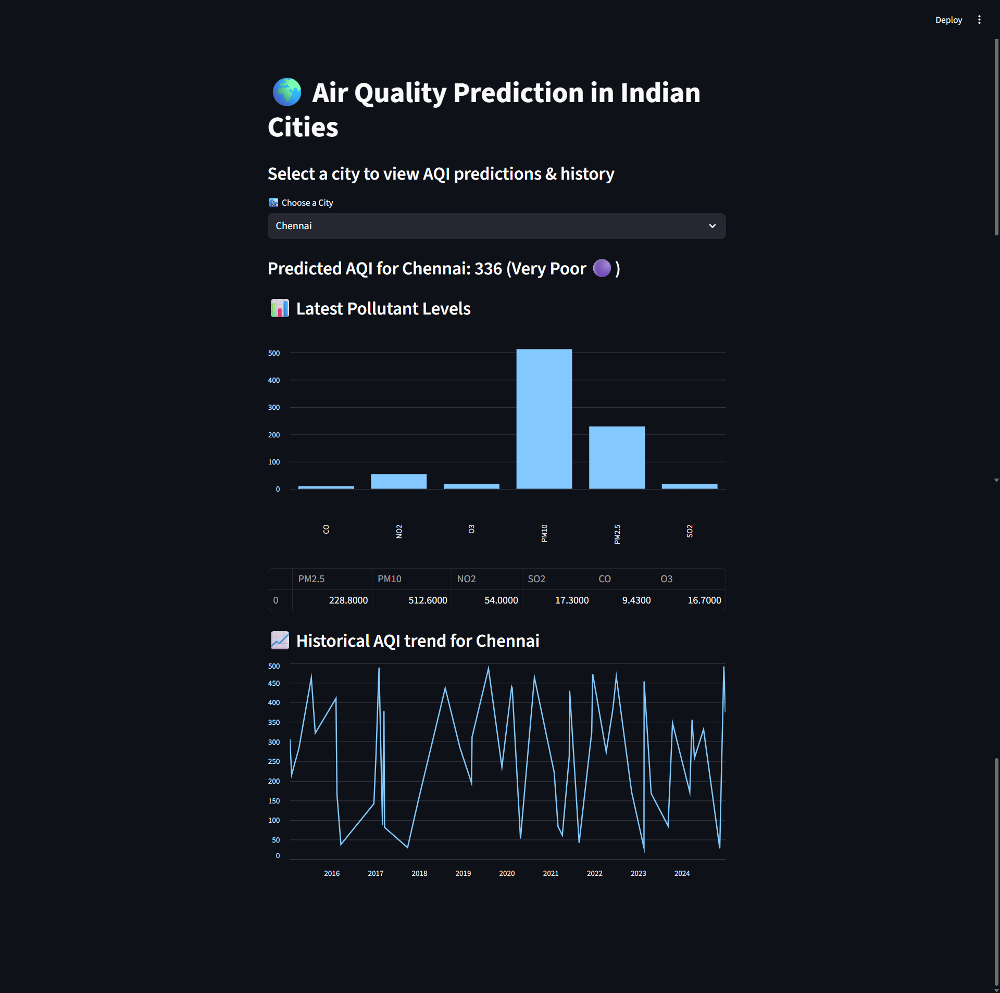

# 🌍 Air Quality Prediction in Indian Cities

This project predicts the **Air Quality Index (AQI)** of Indian cities based on major air pollutants using a **Random Forest Regressor**.  
A **Streamlit web app** is included to visualize pollutant levels, AQI trends, and predictions for different cities.

---

## 📂 Project Structure
```bash
AIR_QUALITY/
│── data/
│ └── air_quality.csv # Dataset (pollutant levels + AQI)
│
│── model/
│ └── aqi_model.pkl # Trained RandomForest model
│
│── notebooks/ # Jupyter notebooks for step-by-step workflow
│ ├── 01_data_exploration.ipynb
│ ├── 02_preprocessing.ipynb
│ ├── 03_model_training.ipynb
│ ├── 04_evaluation.ipynb
│ └── 05_deployment.ipynb
| └── final_submission.ipynb
│
│── app.py # Streamlit app for AQI prediction & visualization
│── model_train.py # Script to train and save AQI model
│── requirements.txt # Dependencies
│── README.md # Project documentation
```
---

## ⚙️ Installation

Clone the repo and install dependencies:

```bash
git clone https://github.com/sathya3103/air_quality.git
cd air_quality
pip install -r requirements.txt
```
---

## 📊 Training the Model

Run the training script:
```bash
python model_train.py
```

Example Output:
```bash
✅ Using local dataset: data/air_quality.csv
🔧 Cleaning dataset...
🚀 Training RandomForestRegressor...
✅ Model trained successfully!
📊 MAE: 23.30, R²: 0.88
💾 Model saved to model/aqi_model.pkl
🎉 Training complete!
```

---

## 💻 Running the Web App

Launch the Streamlit app:
```bash
python -m streamlit run app.py

You’ll see something like:

Local URL: http://localhost:8501
Network URL: http://10.97.24.12:8501

Open the local URL in your browser.
```

---

## 🖼️ Features of the Streamlit App

✅ Select a city and view predicted AQI

✅ Pollutant breakdown (PM2.5, PM10, NO2, SO2, CO, O3)

✅ Historical AQI trends (line chart)

✅ AQI Category Classification

Good 🟢
Satisfactory 🟡
Moderate 🟠
Poor 🔴
Very Poor 🟣
Severe ⚫

---

## 🧪 Technologies Used
```bash

Python 3.9+

Pandas – Data processing

Scikit-learn – Machine learning (RandomForestRegressor)

Streamlit – Interactive web app

Matplotlib / Plotly – Visualization

Joblib – Model serialization
```
---
## 🙌 Author

Developed by E.Sathyanesar as part of a Machine Learning project.
Feel free to fork, contribute, and improve! 🚀
